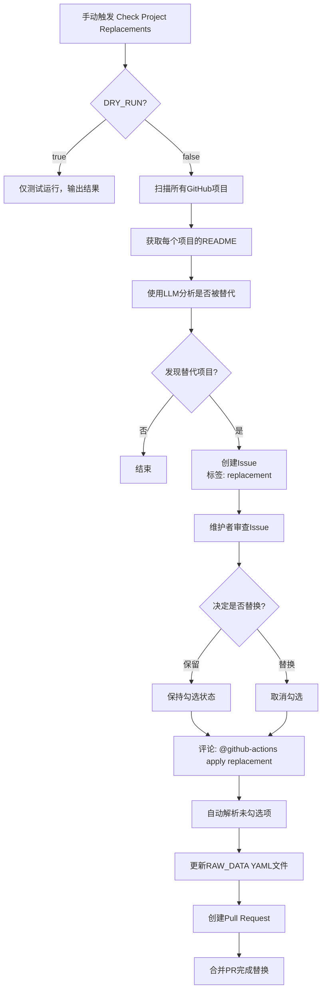

# 项目替代检测功能 - 使用指南

## 工作流程图



## 快速开始

### 1. 首次测试（推荐）

```bash
# 在 GitHub Actions 页面
1. 选择 "Check Project Replacements" workflow
2. 点击 "Run workflow"
3. 保持 DRY_RUN = true（默认）
4. 查看运行日志，确认功能正常
```

### 2. 正式运行

```bash
# 在 GitHub Actions 页面
1. 选择 "Check Project Replacements" workflow
2. 点击 "Run workflow"
3. 设置 DRY_RUN = false
4. 等待运行完成
5. 检查是否创建了新的 Issue
```

### 3. 处理 Issue

当发现替代项目时，会创建类似这样的 Issue：

```markdown
## Replacement Review

请**取消勾选**要替换的项目。默认全部保留。

### 发现替代项目

- [ ] [bilibili-api](https://github.com/old-owner/bilibili-api) → [https://github.com/new-owner/bilibili-api-v2](https://github.com/new-owner/bilibili-api-v2)
  - 理由：README中明确说明"本项目已停止维护，请迁移到 bilibili-api-v2"

- [ ] [old-tool](https://github.com/owner/old-tool) → [https://github.com/owner/new-tool](https://github.com/owner/new-tool)
  - 理由：项目已归档，作者推荐使用新项目

完成后评论：`@github-actions[bot] apply replacement`
```

**操作步骤：**
1. 审查每个发现的替代项目
2. **如果要保留原项目**：保持 `[ ]` 不变（勾选状态）
3. **如果要替换为新项目**：改为 `[x]`（取消勾选）
4. 在评论区输入：`@github-actions[bot] apply replacement`

### 4. 自动创建 PR

机器人会自动：
- 解析 Issue 中未勾选（`[x]`）的项目
- 更新对应的 YAML 文件
- 创建 Pull Request
- 在 Issue 中留下 PR 链接

## 示例场景

### 场景1：项目已归档并有新项目

**检测结果：**
- 原项目：`https://github.com/user/old-project` （已归档）
- README中提到："本项目已停止维护，请使用 https://github.com/user/new-project"

**Issue内容：**
```markdown
- [ ] [old-project](https://github.com/user/old-project) → [https://github.com/user/new-project](https://github.com/user/new-project)
  - 理由：项目已归档，README明确指向新项目
```

**操作：** 取消勾选 → 评论 `apply replacement` → 自动创建PR

### 场景2：误报或不想替换

**检测结果：**
- LLM可能误判某些项目

**操作：** 保持勾选状态（不取消）→ 不评论 → Issue关闭时无操作

## 技术细节

### LLM Prompt 示例

```
你是一个项目维护助手。请分析以下GitHub项目的README内容，判断该项目是否明确说明自己已被另一个项目替代或迁移。

如果项目明确提到：
- 已被新项目替代/取代
- 已迁移到新仓库
- 不再维护，推荐使用其他项目
- 有指向新项目的链接

请返回JSON格式...
```

### 替换逻辑

```javascript
// 从 Issue 中提取未勾选的项目
// 格式：- [x] [Original](url1) → [Replacement](url2)

// 更新 YAML
{
  name: "项目名称",
  link: "new-owner/new-repo",  // 替换为新的仓库路径
  from: "github",
  description: "...",
  icon: [...]
}
```

## 常见问题

### Q: 为什么有些项目没有被检测到？

A: 可能的原因：
- README中没有明确提到被替代
- 使用的是非标准的表述方式
- README无法获取（网络问题或权限问题）

### Q: LLM 会误判吗？

A: 有可能。这就是为什么需要人工审查和确认。LLM 只是辅助工具，最终决定权在维护者手中。

### Q: 可以批量处理多个替代项目吗？

A: 可以。一个 Issue 中可以包含多个替代项目，一次性确认后创建单个 PR。

### Q: 如何撤销替换？

A: 如果 PR 还未合并，直接关闭 PR 即可。如果已合并，可以通过 git revert 撤销。

## 环境变量配置

确保在 GitHub Repository Settings → Secrets and variables → Actions 中配置：

| 变量名 | 说明 | 必需 |
|--------|------|------|
| `LLM_API_URL` | LLM API 端点 | ✅ |
| `LLM_API_KEY` | API 密钥 | 可选 |
| `LLM_MODEL` | 模型名称 | 可选（默认 gpt-4o-mini） |
| `GITHUB_TOKEN` | GitHub Token | ✅（自动提供） |

## 相关文件

- [`src/tools/check-replacement.mjs`](../src/tools/check-replacement.mjs) - 核心检测逻辑
- [`src/generators/apply-replacement.js`](../src/generators/apply-replacement.js) - 应用替换
- [`.github/workflows/check-replacement.yml`](../.github/workflows/check-replacement.yml) - 检查工作流
- [`.github/workflows/apply-replacement.yml`](../.github/workflows/apply-replacement.yml) - 应用工作流
- [`src/tools/check-replacement.test.js`](../src/tools/check-replacement.test.js) - 单元测试
